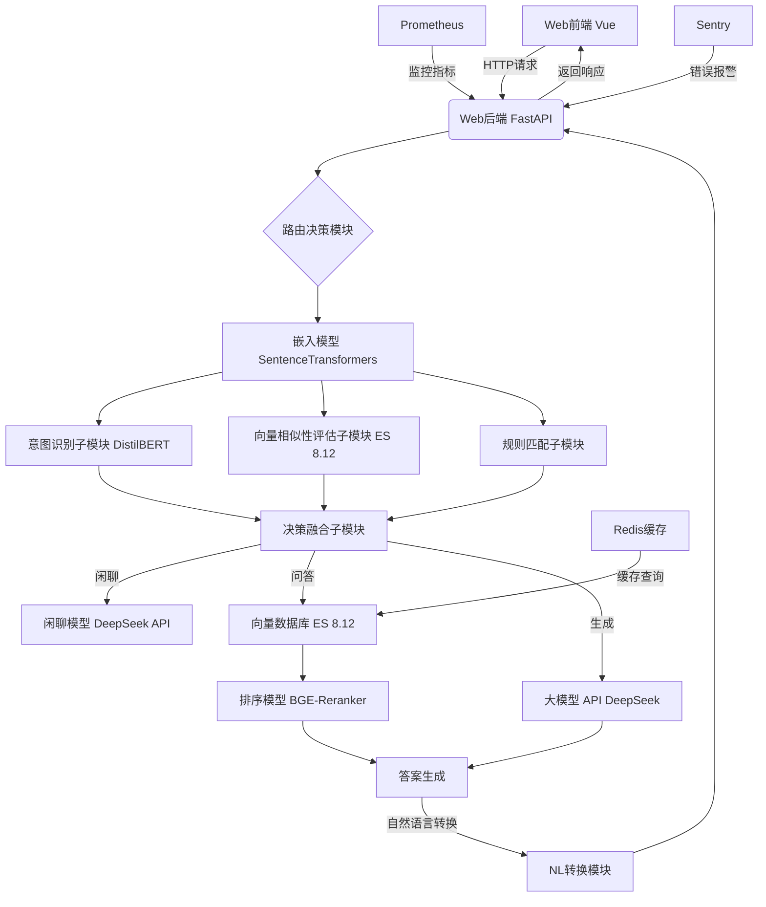

```mermaid
graph TD
A[Web前端 Vue] -->|HTTP请求| B(Web后端 FastAPI)
B --> C{路由决策模块}
C --> D[嵌入模型 SentenceTransformers]
D --> E[意图识别子模块 DistilBERT]
D --> F[向量相似性评估子模块 ES 8.12]
D --> G[规则匹配子模块]
E --> H[决策融合子模块]
F --> H
G --> H
H -->|闲聊| I[闲聊模型 DeepSeek API]
H -->|问答| J[向量数据库 ES 8.12]
J --> K[排序模型 BGE-Reranker]
H -->|生成| L[大模型 API DeepSeek]
K --> M[答案生成]
L --> M
M -->|自然语言转换| N[NL转换模块]
N --> B
B -->|返回响应| A
O[Redis缓存] -->|缓存查询| J
P[Prometheus] -->|监控指标| B
Q[Sentry] -->|错误报警| B
```